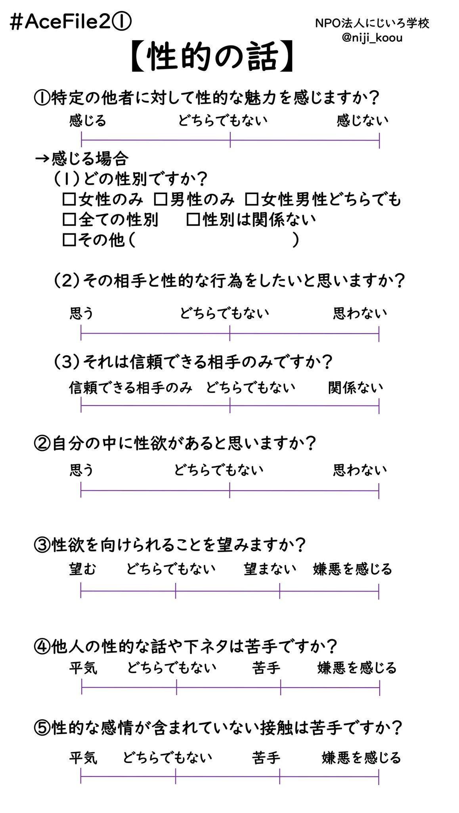

# AceFile
質問に答えることでプロフィールが作れるプロフィールカード作成サイトです。javascript製です。

before  
  
after  

# 使い方
https://ace-file.com/AceFile  
https://ace-file.com/Aro_AceFile

1 使いたいURLを開く  
2 質問フォームに入力  
3 完成！ボタンを押すと画像が表示  
4 問題なければ必要な画像のダウンロードボタンを押す  

# 動作環境
Windows(Google Chrome,Microsoft Edge)Android(Google Chrome)のみ動作確認済。その他の環境でも動くはずですが未確認です。  
iOSでは画像上のフォントがひと回り大きくなるようです。iOSでも収まる設定にすることで対応していますが、手元に環境がなく根本的な解決はできていません。

# 工夫点
画像の加工の仕方がわからなかったり面倒くさいという方を主な利用者と想定し、わかりやすく直感的に利用できるような工夫をしています。
具体的には、数直線上に置かれる項目に、近い見た目のつまみを用意したり、改行をプログラム側で行ってしまう、ダウンロードボタンを用意する、といった部分です。  
また、この開発を始めるまで、JavaScriptを利用したことがなかったのですが、Canvusの機能が今回の目的に適していたので挑戦しました。
初めて利用する言語なのでわからないことも多く、技術的に高度なことはあまりできていませんが、使いやすいサービスにするという目的は達成できました。  

### 裏話
元々PHPも使っていてherokuで公開していたのですが、有料化に伴い総JavaScript化しGitHub Pagesに移しました。
その際コンスタントに利用者がいるようなのでドメインも購入しました。ご利用ありがとうございます。
